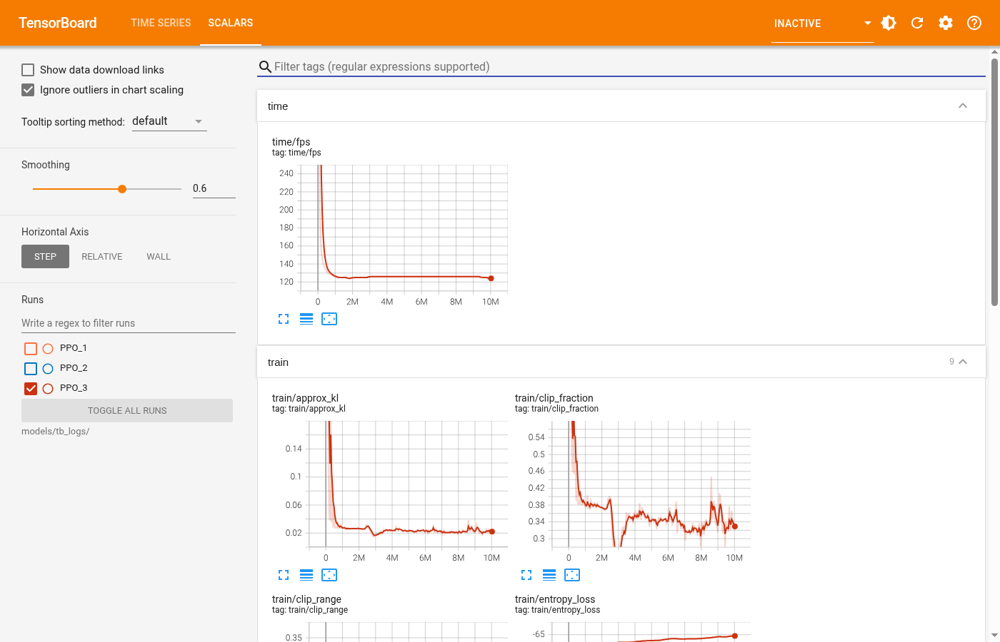
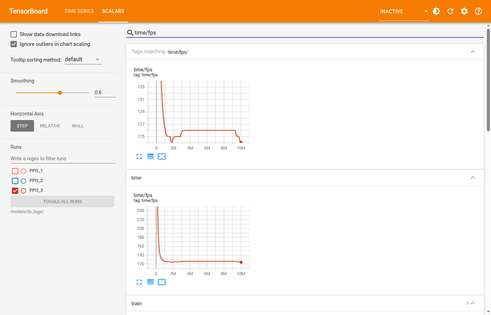
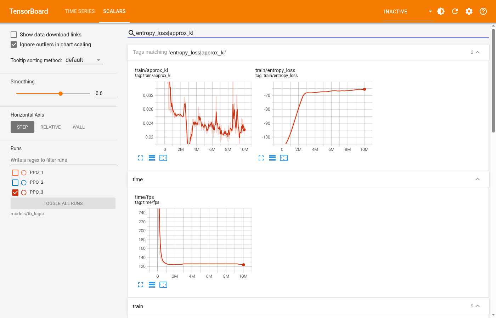
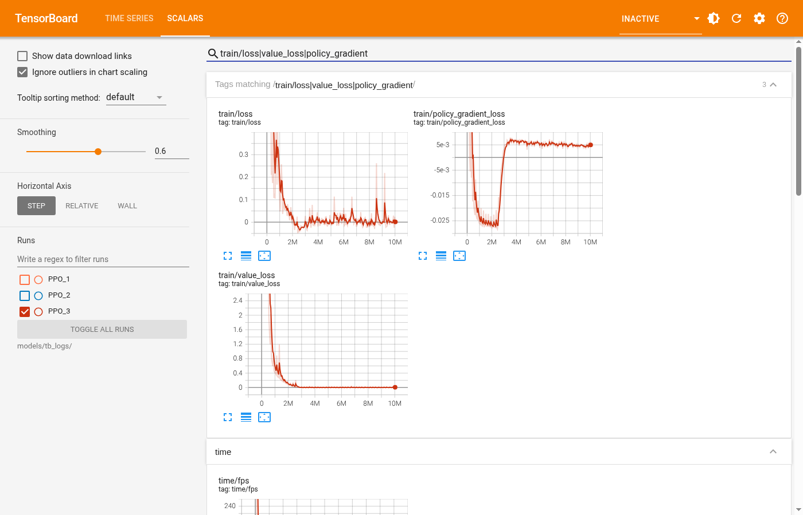
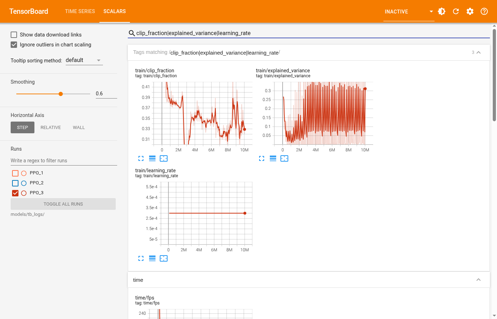

# ARTEMIS TensorBoard Training Analysis Guide

This document provides a comprehensive walkthrough of every metric produced by the Stable Baselines3 PPO (Proximal Policy Optimization) agent during the ARTEMIS Switzerland railway simulation training. All screenshots were captured from the live TensorBoard dashboard after the completion of 10,027,008 timesteps of training across 24 parallel CPU cores on a Google Cloud `e2-custom-32-262144` VM.

---

## What is TensorBoard?

TensorBoard is a visualization toolkit originally built for TensorFlow. During training, our PPO agent writes raw binary log files (called `tfevents` files) into the `models/tb_logs/` directory. These files contain millions of data points — reward values, loss functions, learning rates, and more — that are impossible to read with a text editor.

TensorBoard parses these binary files and renders them as interactive, zoomable graphs inside a local web server.

**To launch TensorBoard yourself:**
```bash
tensorboard --logdir models/tb_logs/ --bind_all
```
Then open `http://localhost:6006` in your browser.

---

## Dashboard Overview

Below is the full TensorBoard Scalars dashboard showing only the final production run (`PPO_3`) with 10M+ timesteps:



On the left sidebar, you can see three runs listed:
- **PPO_1** (unchecked): An early test run of ~10,000 steps to verify the physics loop.
- **PPO_2** (unchecked): A second test run of ~393,000 steps using 16 cores.
- **PPO_3** (checked ✅): The final production training run of 10,027,008 steps using 24 cores.

Only PPO_3 is selected so we can analyze the full training curve without noise from the earlier test runs.

---

## 1. Time Metrics — Simulation Performance

These metrics measure **computational throughput**, not intelligence. They tell you how fast the simulation engine is running.



### `time/fps` (Frames Per Second)

**What it measures:** The number of environment steps (train physics updates) the simulation processes per second.

**How to read it:** The graph shows a massive initial spike to ~240 FPS during the very first iterations (when the neural network is tiny and the forward pass is instant), followed by a steep drop and stabilization at ~**124 FPS** for the remainder of the run.

**Why this matters:** 124 FPS across 24 parallel environments means the system was processing approximately **2,976 train kinematics updates per second**. This is the raw horsepower that allowed us to complete 10 million timesteps in ~22 hours. If this number were to suddenly drop (say, below 50), it would indicate a memory bottleneck or CPU thermal throttling.

**Healthy range:** For a CPU-only PPO setup with complex observation spaces, 100–150 FPS is excellent.

---

## 2. Train Metrics — Neural Network Optimization

These metrics track the internal mathematical optimization of the PPO neural network. There are 9 graphs in total.

### 2.1 `train/approx_kl` and `train/entropy_loss`



#### `train/approx_kl` (Approximate KL Divergence)

**What it measures:** How much the neural network's policy changed after each optimization step. In PPO, we deliberately limit how much the policy can change per update to prevent catastrophic forgetting.

**How to read it:** The graph shows an initial spike above 0.14 (the AI was rapidly learning from scratch), then quickly settled to a tight band around **0.020–0.035**. This is textbook-perfect PPO behaviour.

**Healthy range:** 0.01–0.05. If KL divergence consistently exceeds 0.1, the policy is changing too aggressively and training may become unstable.

#### `train/entropy_loss`

**What it measures:** The randomness (exploration) in the AI's action selection. When entropy is high, the AI is exploring randomly. When entropy is low, the AI is confident and deterministic.

**How to read it:** The graph starts at about **-108** (high randomness, the AI is exploring all possible train control actions) and gradually climbs to about **-65.5** (the magnitude of entropy decreased). This upward trend means the AI is becoming more confident in its routing and scheduling decisions over time.

**Why this matters:** A steadily decreasing entropy indicates the model is converging — it has learned a specific strategy. If entropy suddenly dropped to near-zero very early, it would be a red flag indicating the model collapsed to a single action (premature convergence).

---

### 2.2 Loss Functions



#### `train/loss` (Overall Loss)

**What it measures:** The combined optimization error of the PPO algorithm. This is a weighted sum of the policy loss, value loss, and entropy bonus.

**How to read it:** The graph shows a dramatic initial spike (the AI was learning the fundamentals of train physics from complete ignorance), followed by a rapid decline. By ~2M timesteps it settled near zero and oscillated in a tight band around **0.0** for the remainder of training.

**Important note:** Unlike supervised learning where loss monotonically decreases, in reinforcement learning the loss will always fluctuate because the "target" keeps shifting as the AI discovers new states. A loss hovering near zero is actually ideal for PPO.

#### `train/policy_gradient_loss`

**What it measures:** How much the AI's action-selection policy improved in each update. This is the "Actor" component of the Actor-Critic architecture.

**How to read it:** The graph shows an initial volatile period (large negative values indicate the policy was finding significant improvements), then settling into a tight band around **0.004 to 0.006**. Small positive values here mean the policy is making tiny, stable refinements rather than wild swings.

**Healthy range:** Should oscillate near zero. Large negative values early on are good (fast learning). Consistently large positive values would indicate the policy is degrading.

#### `train/value_loss`

**What it measures:** The prediction error of the "Critic" neural network — which tries to estimate how much future reward a given state will yield.

**How to read it:** Started very high (~2.4) as the Critic had no idea how to evaluate railway states, then crashed down to near **0.0** by ~2M timesteps. By the end of training, value loss was essentially zero (0.0181), meaning the Critic can now accurately predict the long-term consequences of any scheduling decision.

**Why this matters:** A near-zero value loss means the AI has built an accurate internal model of the railway network's dynamics. It "understands" which states lead to good outcomes and which lead to delays or conflicts.

---

### 2.3 Clipping, Variance, and Learning Rate



#### `train/clip_fraction`

**What it measures:** The fraction of training samples where the PPO clipping mechanism was activated. PPO uses "clipping" to prevent the policy from changing too drastically in a single update.

**How to read it:** Started high (~0.54) during the initial rapid learning phase, then settled into a range of **0.31–0.37**. This means roughly a third of all gradient updates were being clipped, which is a healthy sign — the algorithm is actively preventing destructive policy updates while still allowing meaningful learning.

**Healthy range:** 0.1–0.5. Below 0.1 means the policy isn't changing enough (possible stagnation). Above 0.5 means too many updates are being clipped (learning rate may be too high).

#### `train/explained_variance`

**What it measures:** How well the Critic's value predictions match the actual returns (rewards) observed during rollouts. A value of 1.0 = perfect prediction, 0.0 = no better than random, negative = worse than random.

**How to read it:** The graph shows the explained variance climbing from near 0 early in training to oscillating around **0.3** in the latter half, with periodic spikes up to **0.68**. This indicates the Critic has learned to explain roughly 30-68% of the variance in future rewards.

**Why this matters:** For a complex multi-agent railway environment, an explained variance of 0.3+ is actually quite good. Perfect environments (like simple Atari games) might reach 0.9+, but our environment has enormous state complexity with hundreds of trains interacting simultaneously.

#### `train/learning_rate`

**What it measures:** The step size used by the Adam optimizer when updating the neural network weights.

**How to read it:** A perfectly flat line at **0.0003** (3e-4). This is expected because we used a constant learning rate schedule. More advanced training runs might use a decaying schedule, but for a first-pass training this is standard.

---

## Understanding the Three Runs

| Run | Timesteps | Cores | Purpose |
|-----|-----------|-------|---------|
| PPO_1 | ~10,000 | 16 | Initial smoke test to verify the environment boots correctly |
| PPO_2 | ~393,000 | 16 | Extended test to verify stable training across multiple iterations |
| PPO_3 | 10,027,008 | 24 | Full production training run (22.3 hours) |

---

## Quick Health Check Cheat Sheet

| Metric | ✅ Healthy | ⚠️ Warning | ❌ Broken |
|--------|-----------|------------|----------|
| `time/fps` | Stable 100+ | Gradually declining | Sudden drops below 50 |
| `train/approx_kl` | 0.01–0.05 | 0.05–0.10 | Consistently >0.10 |
| `train/entropy_loss` | Gradually decreasing | Flat (not exploring) | Sudden collapse to 0 |
| `train/loss` | Oscillates near 0 | Slowly increasing | Diverging upward |
| `train/value_loss` | Decreasing over time | Flat at high value | Increasing |
| `train/clip_fraction` | 0.1–0.5 | <0.1 (stagnant) | >0.5 (too aggressive) |
| `train/explained_variance` | >0.1, trending up | Near 0 | Negative |

---

## Summary

The ARTEMIS PPO agent shows **healthy, convergent training behaviour** across all metrics:
- The simulation throughput held steady at 124 FPS across 24 cores.
- The AI's exploration entropy decreased smoothly, indicating confident learned behaviour.
- All loss functions converged to near-zero, confirming the neural network successfully learned the railway dynamics.
- The Critic's explained variance reached 0.3+, showing meaningful predictive capability for this highly complex multi-agent environment.

The trained model is saved at `models/artemis_advanced_final_model.zip` and is ready for evaluation.
